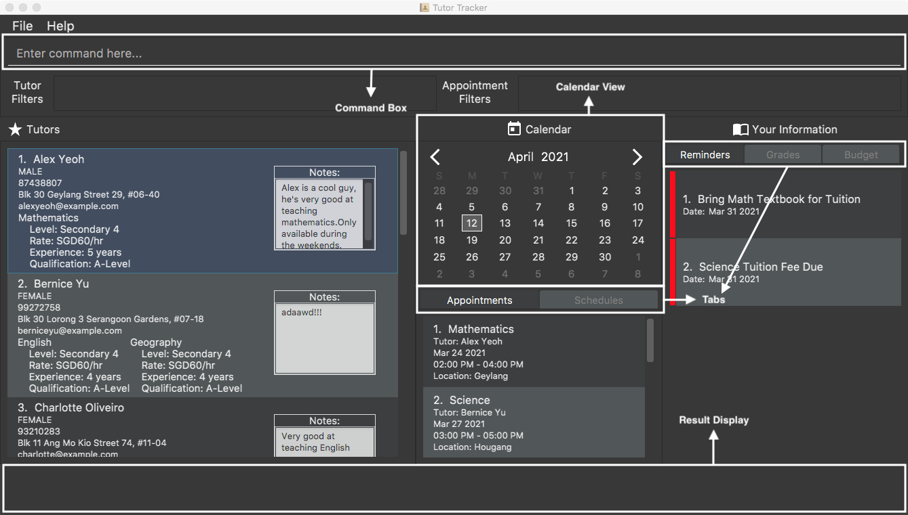
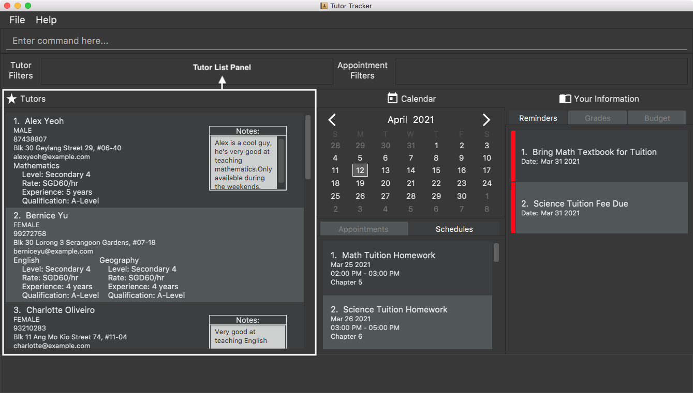
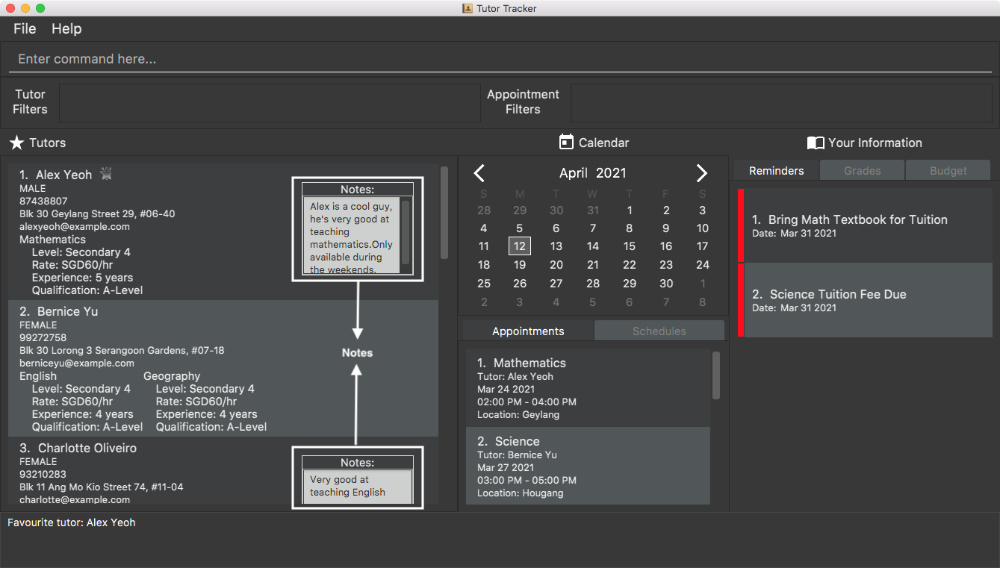
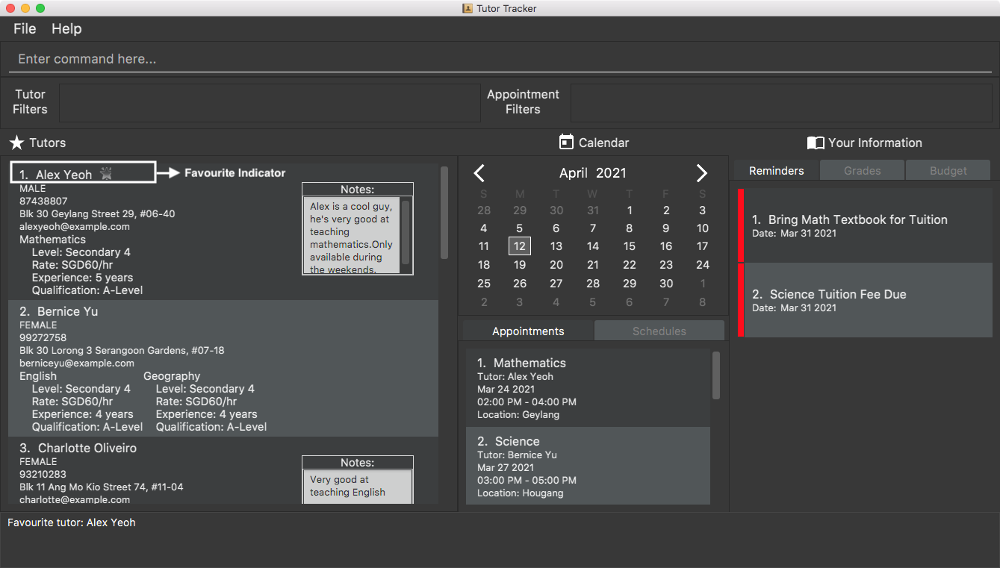
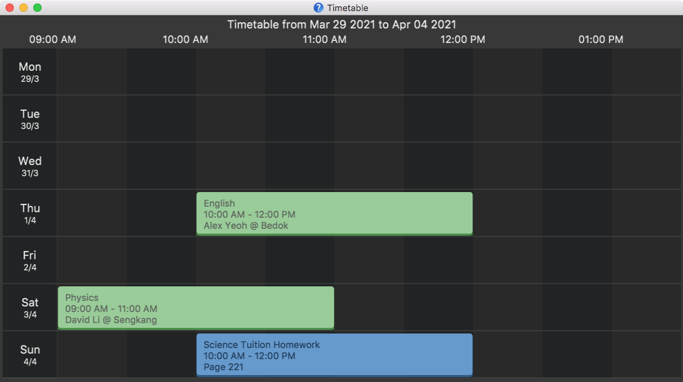
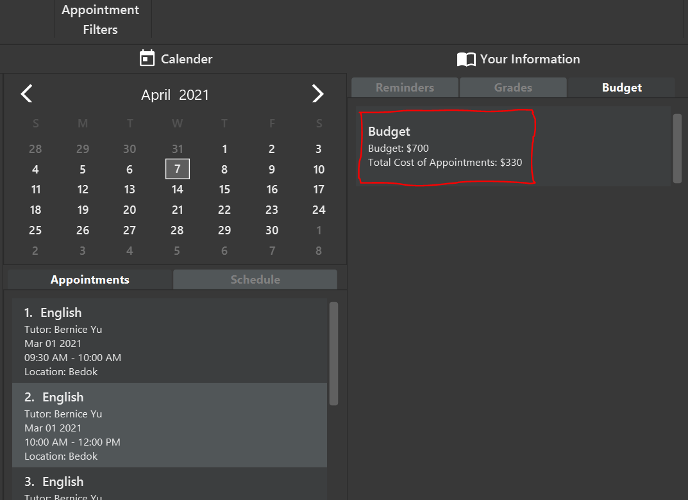
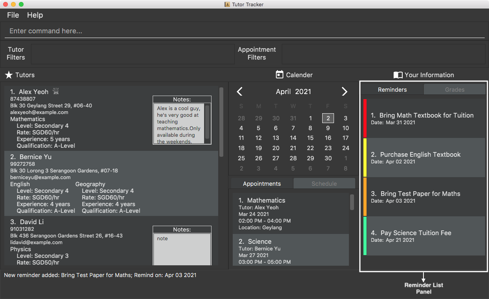

* Table of Contents
{:toc}

--------------------------------------------------------------------------------------------------------------------

## Introduction

_**Tutor Tracker**_ is a **desktop app designed to help secondary school students manage tutors and tuition appointments, optimised for use via a Command Line Interface** (CLI) for a fast and streamlined experience while still having the benefits of a Graphical User Interface (GUI). If you can type fast, Tutor Tracker can get your tuition contact management tasks done faster than traditional GUI apps.

## Quick Start

1. Ensure you have Java `11` or above installed in your Computer.

1. Download the latest `tutortracker.jar` from [here](https://github.com/AY2021S2-CS2103-T14-3/tp/releases).

1. Copy the file to the folder you want to use as the _home folder_ for your TutorTracker.

1. Double-click the file to start the app. The GUI similar to the below should appear in a few seconds. Note how the app contains some sample data.<br>
   

1. Type the command in the command box and press Enter to execute it. e.g. typing **`help`** and pressing Enter will open the help window.<br>
   Some example commands you can try:

    * **`add_appointment`** `n/Charlotte Oliveiro s/English d/2021-04-20 fr/2:00 PM to/4:00 PM l/Bedok` : Adds an appointment with a tutor named `Charlotte Oliveiro` to the Tutor Tracker.
    * **`list_appointments`** : Lists all personal tuition appointments.

1. Refer to the [Features](#features) below for details of each command.

--------------------------------------------------------------------------------------------------------------------

## Application Layout

The figure below shows the GUI of TutorTracker, annotated with a description of each GUI component.



## Features

This section contains all the information about features of TutorTracker. You may enter a command into the Command Box to use each feature or sub-feature.

<div markdown="block" class="alert alert-info">

**:information_source: Notes about the command format:**<br>

* Words in `UPPER_CASE` are the parameters to be supplied by the user.<br>
  e.g. in `add_tutor n/NAME`, `NAME` is a parameter which can be used as `add_tutor n/John Doe`.

* Items in square brackets are optional.<br>
  e.g `n/NAME [l/LOCATION]` can be used as `n/John Doe l/Clementi` or as `n/John Doe`.

* Items with `…`​ after them can be used multiple times including zero times.<br>
  e.g. `[l/LOCATION]…​` can be used as ` ` (i.e. 0 times), `l/Bedok`.

* Items that have date as a parameter must strictly follow `YYYY-MM-DD` format.<br> 
  e.g. `2021-03-01`and `2021-04-20`.

* Items that have time as parameter must strictly follow `HH:MM AM/PM` format.<br>
  e.g. `9:01 AM` and `10:30 PM`.

* Parameters can be in any order.<br>
  e.g. if the command specifies `n/NAME s/SUBJECT`, `s/SUBJECT n/NAME` is also acceptable.

* If a parameter is expected only once in the command but you specified it multiple times, only the last occurrence of the parameter will be taken.<br>
  e.g. if you specify `l/Bedok l/Clementi`, only `l/Clementi` will be taken.

* Extraneous parameters for commands that do not take in parameters (such as `help` and `exit`) will be ignored.<br>
  e.g. if the command specifies `help 123`, it will be interpreted as `help`.

* Parameters in angle brackets (`<`, `>`) must be supplied together as a group. eg. with `<s/SUBJECT_NAME r/RATE>`, both subject name and rate must be supplied.

</div>

### Tutor Book
This feature allows tutees to maintain and keep track of the list of tuition tutors.



**Attributes / Parameters**:
* Name
* Gender
* Phone Number
* Email
* Address
* Subjects (multiple allowed)
    * Subject Name
    * Subject Hourly Rate
    * Subject Education Level
    * Subject Years of Experience
    * Subject Qualifications
* Note

#### Add a new tutor: `add_tutor`

Add a new tutor and enter their basic details as well as an optional Note.

Format:
`add_tutor n/NAME g/GENDER p/PHONE_NUMBER e/EMAIL  a/ADDRESS <s/SUBJECT_NAME r/SUBJECT_RATE l/SUBJECT_EDUCATION_LEVEL y/SUBJECT_YEARS_EXPERIENCE q/SUBJECT_QUALIFICATIONS>... notes/NOTE`

Example Input:
`add_tutor n/John Doe g/Male p/98765432 e/johnd@example.com a/John street, block 123, #01-01 s/English r/50 l/Secondary 3 y/5 q/A-Level s/Mathematics r/60 l/Secondary 4 y/6 q/A-Level notes/Patient`

#### List tutors: `list_tutors`

View a list of all tutors known. Will ignore all input after `list_tutors`.

Example Output:
```
1. John Doe
98765432
John street, block 123, #01-01
johnd@example.com
Subjects:
English
    Level: Sec 3
    Rate: SGD60/hr
    Experience: 6 years
    Qualification: Bachelor of English Literature
    
2. Jane Doe 
98765433
Jane street, block 123, #01-01
janed@example.com
Subjects:
Maths
    Level: Sec 4
    Rate: SGD30/hr
    Experience: 5 years
    Qualification: Bachelor of Mechanical Engineering
```

#### Delete a tutor: `delete_tutor`

Delete a tutor by index. If a tutor has an existing appointment in the user system
then tutor cannot be deleted.

Format: `delete_tutor INDEX`

Example: `delete_tutor 1`

#### Edit a tutor: `edit_tutor`

Edit a tutor's information by index. Only the attributes present can be changed in the tutor, including notes.

Format: `edit_tutor INDEX [n/NAME] [g/GENDER] [p/PHONE_NUMBER] [e/EMAIL] [a/ADDRESS] [<s/SUBJECT_NAME r/SUBJECT_RATE l/SUBJECT_EDUCATION_LEVEL y/SUBJECT_YEARS_EXPERIENCE q/SUBJECT_QUALIFICATIONS>]... notes/NOTES`

Example: `edit_tutor 1 p/99824314 s/English r/50 l/Secondary 5 y/9 q/A-Level notes/Impatient`

#### View tutor details: `view_tutor`

Views a tutor's personal information.

Format: `view_tutor INDEX`

Example: `view_tutor 1`

Example Output:<br>
```
1. John Doe
98765432
John street, block 123, #01-01
johnd@example.com
Subjects:
English
    Level: Sec 3
    Rate: SGD60/hr
    Experience: 6 years
    Qualification: Bachelor of English Literature
```

#### Notes
This feature allows tutees to track and manages notes that are tagged to a tutor.



##### Add note to a tutor: `add_note`

Shortcut for adding note to tutor at a particular index

Format: `add_note INDEX NOTE`

Example: `add_note 1 patient tutor`

Example Output:
on the right of ,<br>
```
1. John Doe 
98765432
John street, block 123, #01-01
johnd@example.com
Subjects:
English
    Level: Sec 3                     
    Rate: SGD60/hr
    Experience: 6 years
    Qualification: Bachelor of English Literature
```
```
Notes:
patient tutor
```

##### Edit note of a tutor: `edit_note`

Shortcut for editing note to tutor at a particular index

Format: `edit_note INDEX NOTE`

Example: `edit_note 1 not patient`

Example Output:
on the right of ,<br>
```
1. John Doe 
98765432
John street, block 123, #01-01
johnd@example.com
Subjects:
English
    Level: Sec 3                     
    Rate: SGD60/hr
    Experience: 6 years
    Qualification: Bachelor of English Literature
```

```
Notes:
not patient
```
##### Delete note of a tutor: `delete_note`

Deletes solely the note to tutor at a particular index

Format: `delete_note INDEX NOTE`

Example: `delete_note 1`

##### List tutors with note `list_note`
Lists all the tutor with note. Will ignore all input after `list_mote`.

Format:`list_note`

##### Export the tutor details: `export`
Export the tutor details of that index together with the notes and subject list into a text file 
exit
in the directory you saved
TutorTracker in /export/TUTORNAME

Format:`export INDEX`

Example: `export 1`

#### Favourites
This feature allows tutees to track and manage their favourite tutors.



##### Favourite a tutor: `favourite`

Label a tutor as a favourite.

Format: `favourite INDEX`

Example: `favourite 1`

Example Output:<br>
```
1. John Doe *
98765432
John street, block 123, #01-01
johnd@example.com
Subjects:
English
    Level: Sec 3
    Rate: SGD60/hr
    Experience: 6 years
    Qualification: Bachelor of English Literature
```

##### Unfavourite a tutor: `unfavourite`

Removes the favourite label from a tutor

Format: `unfavourite INDEX`

Example: `unfavourite 1`

##### List favourites: `list_favourites`

View a list of all favourites

Format: `list_favourites`

Example: `list_favourites`

### Appointment Tracker
This feature allows tutees to manage and track their tuition appointments.


**Attributes / Parameters**:
* Name of the tutor
* Subject Name
* Appointment Date
* Time From
* Time To
* Location

#### Add a new appointment: `add_appointment`

Adds an appointment with a specific tutor to the timetable.<br>

Format: `add_appointment n/NAME s/SUBJECT d/DATE fr/TIME_FROM to/TIME_TO l/LOCATION`

* The date format `YYYY-MM-DD` must be strictly followed. e.g. `2021-03-01`and `2021-04-20`.
* The time format `HH:MM AM/PM` must be strictly followed. e.g. `9:01 AM` and `10:30 PM`.
* Tutors cannot be double booked. Please ensure that timeslots of each tutor do not 
  clash, i.e., same day, 10:00am - 11:00am and 10:30am - 12:00pm.

Examples:<br>
* `add_appointment n/David Li s/Mathematics d/2021-03-01 fr/10:00 AM to/12:00 PM l/Bedok`
* `add_appointment n/Alex Yeoh s/English d/2021-04-20 fr/2:00 PM to/4:00 PM l/Bedok`

#### List tuition appointments: `list_appointments`

Shows a list of all upcoming tuition appointments in the personal tuition appointment list. Appointments are automatically sorted by ascending order (oldest to newest).

Format: `list_appointments`

Example outputs:
```
1. Mathematics
Tutor: Alex Yeoh
Mar 24 2021
02:00 PM - 04:00 PM
Location: Geylang

2. Science
Tutor: Bernice Yu
Mar 27 2021
03:00 PM - 05:00 PM
Location: Hougang
```

#### View tuition appointment details: `view_appointment`

View details of a tuition appointment via date.

Format:
`view_appointment DATE`

Example:
`view_appointment 2021-03-24`

Example Output:
```
1. Mathematics
Tutor: Alex Yeoh
Mar 24 2021
02:00 PM - 04:00 PM
Location: Geylang
```

Alternatively, users can press the desired date on the calendar panel instead to achieve the same output.

#### Find tuition appointments: `find_appointment`

Find list of tuition appointments based on tutor's name.

Format:
`find_appointment NAME...`

Example:
`find_appointment Alex Yeoh`

Example Output:
```
1. Mathematics
Tutor: Alex Yeoh
Mar 24 2021
02:00 PM - 04:00 PM
Location: Geylang
```

#### Delete a tuition appointment: `delete_appointment`

Format: `delete_appointment INDEX`

Deletes the specific appointment at the specified INDEX.
The index refers to the index number shown in the displayed person list.
The index must be a positive integer e.g. `1, 2, 3, …​`

Example:
`delete_appointment 1`

Example Output:
```
Deleted Appointment: Appointment with Tutor (Alex Poon) from 
Mar 10 2021 05:00PM to Mar 10 2021 07:00PM
```

#### Editing an appointment: `edit_appointment`

Edits an appointment with a specific index. Only the attributes present are changed in the appointment.
If any one of the following three fields (DATE, TIME_FROM, TIME_TO), then all three 
must also be present.

Format: `edit_appointment INDEX [n/NAME] [s/SUBJECT_NAME] [d/DATE] [fr/TIME_FROM] 
[to/TIME_TO] [l/LOCATION]`

* The date format `YYYY-MM-DD` must be strictly followed. e.g. `2021-03-01`and `2021-04-20`.
* The time format `HH:MM AM/PM` must be strictly followed. e.g. `9:01 AM` and `10:30 PM`.
* Tutors cannot be double booked. Please ensure that timeslots of each tutor do not
  clash, i.e., same day, 10:00am - 11:00am and 10:30am - 12:00pm.
  
Examples: `edit_appointment 1 s/English l/Clementi`

### Schedule Tracker
This feature allows tutees to track and manage their tuition-related schedules, i.e., allocating time to do their tuition homework.


**Attributes / Parameters**:
* Title
* Schedule Date
* Time From
* Time To
* Description

#### Adding a schedule : `add_schedule`

Adds a schedule that is related to tuition.<br>

Format: `add_schedule t/TITLE d/DATE fr/TIME_FROM to/TIME_TO ds/DESCRIPTION`

* The date format `yyyy-mm-dd` must be strictly followed. e.g. `2021-3-1`and `2021-03-01`.
* The time format `hh:mm a` must be strictly followed. e.g. `9:01 am` and `10:30 pm`.
* `DATE` and `TIME_FROM` must be in the future.
* `TIME_FROM` and `TIME_TO` must be a valid time range (`TIME_FROM` must be before `TIME_TO`).

Examples:<br>
* `add_schedule t/Science Tuition Homework d/2021-3-31 fr/6:00pm to/7:00pm ds/Chapter 5 to 6`
* `add_schedule t/Maths Tuition Homework d/2021-4-2 fr/5:00pm to/7:00pm ds/Calculus Topic`

#### Listing all schedules : `list_schedules`

This feature shows a list of the tutees's personal schedule. Schedules are automatically sorted by ascending order (oldest to newest).

Format: `list_schedules`

Example outputs:
```
1.  Math Tuition Homework
Mar 24 2021
2:00 PM - 4:00 PM
Chapter 5 to 6
2.  Science Tuition Homework
Mar 30 2021
2:00 PM - 4:00 PM
Calculus Topic
```

#### View schedule details: `view_schedule`

View details of a schedule via date.

Format:
`view_schedule DATE`

Example:
`view_schedule 2021-4-20`

Example Output:
```
1.  Math Tuition Homework
Mar 24 2021
2:00 PM - 4:00 PM
Chapter 5 to 6
```

Alternatively, users can press the desired date on the calendar panel instead to achieve the same output.

#### Delete a schedule: `delete_schedule`

Deletes the specific schedule at the specified INDEX.

Format: `delete_schedule INDEX`

The index refers to the index number shown in the displayed schedule list. <br>
The index must be a positive integer e.g. `1, 2, 3, …​`

Referencing to the example output from `list_schedules`,

Example:
`delete_schedule 1`

Example Output:
```
1.  Science Tuition Homework
Mar 30 2021
2:00 PM - 4:00 PM
Calculus Topic
```

#### Editing a schedule : `edit_schedule`

Edits a schedule with a specific index. Only the attributes present are changed in the schedule.

Format: `edit_schedule INDEX [t/TITLE] [d/DATE] [fr/TIME_FROM] [to/TIME_TO] [ds/DESCRIPTION]`

* The date format `yyyy-mm-dd` must be strictly followed. e.g. `2021-3-1`and `2021-03-01`.
* The time format `hh:mm a` must be strictly followed. e.g. `9:01 am` and `10:30 pm`.
* The edited `DATE` and `TIME_FROM` must be in the future.
* `TIME_FROM` and `TIME_TO` must be a valid time range (`TIME_FROM` must be before `TIME_TO`).

Examples: `edit_schedule 1 t/Science Tuition Homework`

### Event Tracker
Events represent a timetable, which comprises of both `Appointment` and `Schedule`.
This feature allows tutee to track and view their timetable easily.



* Green slots represent `Appointment` and blue slots represent `Schedule`.

#### Opening timetable window : `timetable`

Launch a timetable graphical representation of the tutee's appointment and schedule.

Format: `timetable [DATE]`

* The date is an optional parameter. If there is no date entered, it will display the timetable of the current week. Otherwise, by typing `2021-3-28`, it will show the week's timetable that contains 28 March 2021.
* The date format `yyyy-mm-dd` must be strictly followed. e.g. `2021-3-1` or `2021-03-01`.

### Budget Tracker
This feature allows tutees to track and manage his/her budget allocated to tuitions. 



**Attributes / Parameters**:
* Budget Amount

#### Add a budget: `add_budget`

Adds a budget with an amount specified by user. Stores budget in user system.
Budget must not already exist in user system, otherwise use edit_budget instead.

Format: `add_budget b/BUDGET`

Example:
`add_budget b/500`

Example Output:
```
Budget of 500 is sucessfully added
```

* BUDGET must be a positive integer inclusive of zero

#### Edit a budget: `edit_budget`

Edits an already existing budget with an amount specified by user.

Format : `edit_budget b/BUDGET`

Example:
`edit_budget b/600`

Example Output
```
Budget of 600 is sucessfully updated.
```

* BUDGET must be a positive integer inclusive of zero

#### Delete a budget: `delete_budget`

Deletes an already existing budget.

Format : `delete_budget`

Example:
`delete_budget`

Example Output:
```
Budget of 600 is sucessfully deleted.
```

#### View a budget: `view_budget`

Views an already existing budget.

Format : `view_budget`

Example:
`view_budget`

Example Output:
```
1) Budget does not already exist. Please ensure there is a budget. You can use the 
add_budget function to add a budget.

2) Here is your budget.
Budget: 600
Total Cost of Appointments: 100.
```

### Grade Book
This features allows tutees to track and manage their grades obtained in a particular subjects.


**Attributes / Parameters**:
* Subject Name
* Graded Item
* Alphabet Grade

#### Add a grade: `add_grade`

Adds a grade with a subject, a graded item and a grade alphabet specified by user. Stores in user system.

Format: `add_grade s/SUBJECT_NAME gi/GRADED_ITEM gr/GRADE_ALPHABET`

* Valid `GRADE_ALPHABET` recognized by the system only include A to F, S and U.
* `SUBJECT_NAME` is case-insensitive and `GRADE_ALPHABET` must be uppercase.

Example: `add_grade s/English gi/Final gr/A`

Example Output:
```
New grade added: English (Final): A
```

#### Edit a grade: `edit_grade`

Edits an already existing grade at the specified index. Only the attributes present are changed in the grade.

Format: `edit_grade INDEX [s/SUBJECT_NAME] [gi/GRADED_ITEM] [gr/GRADE_ALPHABET]`

Example: `edit_grade 1 gr/B`

Example Output:
```
Edited Grade: Science (Lab 1): B
```

#### Delete a grade: `delete_grade`

Deletes an already existing grade at the specified index.

Format: `delete_grade INDEX`

Example: `delete_grade 1`

Example Output: 
```
Deleted Grade: Science (Lab 1): B
```

#### List grades: `list_grades`

Views a list of all already existing grades in storage.

Format: `list_grades`

Example: `list_grades`

Example Output:
```
Listed all grades
  1. Science
     Lab 1
     A
  2. Mathematics
     Final
     B
  3. English
     Midterm
     C
```

### Reminder Tracker
This feature allows tutees to track and manage reminders daily. This is exceptionally helpful if the reminders are related to the tuition or the tutor itself, i.e. setting a reminder to pay a particular tutor's tuition fee.



* Red reminder card sidebar represent past reminders.
* Yellow reminder card sidebar represent ongoing reminders.
* Orange reminder card sidebar represent upcoming reminders (less or equal to 3 days).
* Green reminder card sidebar represent upcoming reminders.

**Attributes / Parameters**:
* Description
* Reminder Date

#### Adding a reminder : `add_reminder`

Adds a reminder with description and reminder date specified by the user.<br>

Format: `add_reminder ds/DESCRIPTION d/REMINDER_DATE`
* The date format `yyyy-mm-dd` must be strictly followed. e.g. `2021-3-1`and `2021-03-01`.

Examples:<br>
* `add_reminder ds/Science Tuition Payment Due d/2021-4-2`
* `add_reminder ds/Maths Tuition Payment Due d/2021-4-21`

#### Listing all reminders : `list_reminders`

Shows a list of all personal reminders. Reminders are automatically sorted by ascending order (oldest to newest).

Format: `list_reminders`

Example outputs:
```
1.  Science Tuition Payment
Date: Apr 2 2021
2.  Maths Tuition Payment Due
Date: Apr 21 2021
```

#### Delete a reminder: `delete_reminder`

Deletes the specific reminder at the specified INDEX.

Format: `delete_reminder INDEX`

The index refers to the index number shown in the displayed reminder list. <br>
The index must be a positive integer e.g. `1, 2, 3, …​`

Referencing to the example output from `list_reminders`,

Example: `delete_reminder 1`

Example Output:
```
1.  Maths Tuition Payment Due
Date: Apr 21 2021
```

#### Editing a reminder : `edit_reminder`

Edits a reminder with a specific index. Only the attributes present are changed in the reminder.

Format: `edit_reminder INDEX [ds/DESCRIPTION] [d/REMINDER_DATE]`
* The date format `yyyy-mm-dd` must be strictly followed. e.g. `2021-3-1`and `2021-03-01`.

Examples: `edit_reminder 1 ds/Science Tuition Payment Due`

### Tutor and Appointment Filters 
This feature enhances the tutee's viewing experiences by allowing the tutees to filter tutors or appointments based on attributes.


#### Add a Tutor Filter: `add_tutor_filter`

Adds Tutor Filter(s) to the Tutor Filter list, filtering the tutors that are shown in the
tutor list. Note that tutor filters **are not persistent (are not saved)**. The following tutor
attributes and subject attributes in each tutor are filterable:

Inclusive Filters:
* Name
* Gender
* Phone Number
* Email
* Address
* Subject Name
* Subject Education Level
* Subject Qualifications

Exclusive Filters:
* Subject Hourly Rate
* Subject Years of Experience

Multiples of each attribute are allowed, with the composed filter following these rules:

1) Filters are case-insensitive.
2) An inclusive filter means that a tutor can match any of the filters within that attribute filter.
3) An exclusive filter means that a tutor must match all of the filters within that attribute filter.
4) Inclusive filters match as long as the tutor attirbute contains the filter. eg. The tutor `Peter` matches the filter `pete`.
5) Exclusive filters support the following inequalities: `>, <, >=, <=, =`.
6) Only tutors that match all the attribute filters are displayed.

Format: `add_tutor_filter [n/NAME]... [g/GENDER]... [p/PHONE_NUMBER]... [e/EMAIL]... [a/ADDRESS]... [s/SUBJECT_NAME]... [r/SUBJECT_RATE]... [l/SUBJECT_EDUCATION_LEVEL]... [y/SUBJECT_YEARS_EXPERIENCE]... [q/SUBJECT_QUALIFICATIONS]...`

Example: `add_tutor_filter r/>=40 r/<60 l/Secondary`

Example_Output: `New tutor filter added: Subject Level: secondary, Subject Rate: >= 40, Subject Rate: < 60`

#### Delete a Tutor Filter: `delete_tutor_filter`

Deletes Tutor Filter(s) from the Tutor Filter list, supporting the same attributes as `add_tutor_filter`.

Format: `delete_tutor_filter [n/NAME]... [g/GENDER]... [p/PHONE_NUMBER]... [e/EMAIL]... [a/ADDRESS]... [s/SUBJECT_NAME]... [r/SUBJECT_RATE]... [l/SUBJECT_EDUCATION_LEVEL]... [y/SUBJECT_YEARS_EXPERIENCE]... [q/SUBJECT_QUALIFICATIONS]...`

Example: `delete_tutor_filter r/<60 l/Secondary`

Example_Output: `Tutor filters deleted: Subject Level: secondary, Subject Rate: < 60`

#### Add an Appointment Filter: `add_appointment_filter`

Adds Appointment Filter(s) to the Appointment Filter list, filtering the appointments that are shown
in the appointment list. Note that appointment filters **are not persistent (are not saved)**. The
following appointment attributes are filterable:

Inclusive Filters:
* Name
* Subject Name
* Location

Exclusive Filters:
* From Date Time
* To Date Time

Multiples of each attribute are allowed, with the composed filter following these rules:

1) Filters are case-insensitive.
2) An inclusive filter means that an appointment can match any of the filters within that attribute filter.
3) An exclusive filter means that an appointment must match all of the filters within that attribute filter.
4) Inclusive filters match as long as the appointment attirbute contains the filter. eg. The appointment with tutor name `Peter` matches the filter `pete`.
5) Exclusive filters support the following inequalities: `>, <, >=, <=, =`.
6) The date time format `YYYY-MM-DD HH:MM AM/PM` must be strictly followed. e.g. `2021-03-25 10:00 AM`.
7) Only appointments that match all the attribute filters are displayed.

Format: `add_appointment_filter [n/NAME]... [s/SUBJECT_NAME]... [fr/FROM_DATE_TIME]... [to/TO_DATE_TIME]... [l/LOCATION]...`

Example: `add_appointment_filter to/>2021-03-25 10:00 AM`

Example_Output: `New appointment filter added: Date Time: > Mar 25 2021 10:00AM`

#### Delete an Appointment Filter: `delete_appointment_filter`

Deletes Appointment Filter(s) from the Appointment Filter list, supporting the same attributes as `add_appointment_filter`.

Format: `delete_appointment_filter [n/NAME]... [s/SUBJECT_NAME]... [fr/FROM_DATE_TIME]... [to/TO_DATE_TIME]... [l/LOCATION]...`

Example: `delete_appointment_filter to/>2021-03-25 10:00 AM`

Example_Output: `Appointment filters deleted: Date Time: > Mar 25 2021 10:00AM`

### Exit App: `exit`

Closes the app.

--------------------------------------------------------------------------------------------------------------------

## FAQ

**Q**: How do I transfer my data to another Computer?<br>
**A**: Install the app in the other computer and overwrite the empty data file it creates with the file that contains the data of your previous Tutor Tracker home folder.
--------------------------------------------------------------------------------------------------------------------

## Command Summary

Action | Format | Examples
--------|--------|----------
**Add a new tutor** | `add_tutor n/NAME g/GENDER p/PHONE_NUMBER e/EMAIL  a/ADDRESS <s/SUBJECT_NAME r/SUBJECT_RATE l/SUBJECT_EDUCATION_LEVEL y/SUBJECT_YEARS_EXPERIENCE q/SUBJECT_QUALIFICATIONS>... notes/NOTE` | `add_tutor n/John Doe g/Male p/98765432 e/johnd@example.com a/John street, block 123, #01-01 s/English r/50 l/Secondary 3 y/5 q/A-Level s/Mathematics r/60 l/Secondary 4 y/6 q/A-Level notes/Patient`
**List tutors** | `list_tutors` | `list_tutors`
**Delete a tutor** | `delete_tutor INDEX` | `delete_tutor 1`
**Edit a tutor** | `edit_tutor INDEX [n/NAME] [g/GENDER] [p/PHONE_NUMBER] [e/EMAIL] [a/ADDRESS] [<s/SUBJECT_NAME r/SUBJECT_RATE l/SUBJECT_EDUCATION_LEVEL y/SUBJECT_YEARS_EXPERIENCE q/SUBJECT_QUALIFICATIONS>]... notes/NOTES` | `edit_tutor 1 p/99824314 s/English r/50 l/Secondary 5 y/9 q/A-Level notes/Impatient`
**View tutor details** | `view_tutor INDEX` | `view_tutor 1`
**Add note to a tutor** | `add_note INDEX NOTE` | `add_note 1 patient tutor`
**Edit note of a tutor** | `edit_note INDEX NOTE` | `edit_note 1 not patient`
**Delete note of a tutor** | `delete_note INDEX` | `delete_note 1`
**List tutors with note** | `list_note` | `list_note`
**Export the tutor details**| `export INDEX` | `export 1`
**Favourite a tutor** | `favourite INDEX`, | `favourite 1`
**Unfavourite a tutor** | `unfavourite INDEX` | `unfavourite 1`
**List favourites** | `list_favourites` | `list_favourites`
**Add a new tuition appointment** | `add_appointment n/NAME s/SUBJECT d/DATE fr/TIME_FROM to/TIME_TO l/LOCATION` | `add_appointment n/David Li s/Mathematics d/2021-03-01 fr/10:00 AM to/12:00 PM l/Bedok`
**List tuition appointments** | `list_appointments` | `list_appointments`
**View tuition appointment details** | `view_appointment DATE` | `view_appointment 2020-03-24`
**Find tuition appointments** | `find_appointment NAME...` | `find_appointment Alex Yeoh`
**Delete a tuition appointment** | `delete_appointment INDEX` | `delete_appointment 1`
**Edit a tuition appointment** | `edit_appointment INDEX [n/NAME] [s/SUBJECT_NAME] [d/DATE] [fr/TIME_FROM] [to/TIME_TO] [l/LOCATION]` | `edit_appointment 1 s/English l/Clementi`
**Add a new schedule** | `add_schedule t/TITLE d/DATE fr/TIME_FROM to/TIME_TO ds/DESCRIPTION` | `add_schedule n/Science Tuition Homework d/2021-3-31 fr/6:00pm to/7:00pm ds/Chapter 5 to 6`
**List schedules** | `list_schedules` | `list_schedules`
**View schedule details** | `view_schedule DATE` | `view_schedule 2020-03-24`
**Delete a schedule** | `delete_schedule INDEX` | `delete_schedule 1`
**Edit a schedule** | `edit_schedule INDEX [t/TITLE] [d/DATE] [fr/TIME_FROM] [to/TIME_TO] [ds/DESCRIPTION]` | `edit_schedule 1 t/Science Tuition Homework`
**View timetable** | `timetable [DATE]` | `timetable 2021-3-28`
**Add a budget** | `add_budget b/BUDGET` |`add_budget b/500`
**Edit a budget** | `edit_budget b/BUDGET` | `edit_budget b/600`
**Delete a budget** | `delete_budget` | `delete_budget`
**View a budget** | `view_budget` | `view_budget`
**Add a grade** | `add_grade s/SUBJECT_NAME gi/GRADED_ITEM gr/GRADE_ALPHABET`, | `add_grade s/English gi/Final gr/A` 
**Edit a grade** | `edit_grade INDEX [s/SUBJECT_NAME] [gi/GRADED_ITEM] [gr/GRADE_ALPHABET]`, | `edit_grade 1 gr/B`
**Delete a grade** | `delete_grade INDEX`, | `delete_grade 1`
**List grades** | `list_grades` | `list_grades`
**Add a new reminder** | `add_reminder ds/DESCRIPTION d/REMINDER_DATE` | `add_reminder ds/Science Tuition Payment Due d/2021-4-2`
**List reminders** | `list_reminders` | `list_reminders`
**Delete a reminder** | `delete_reminder INDEX` | `delete_reminder 1`
**Edit a reminder** | `edit_reminder INDEX [ds/DESCRIPTION] [d/REMINDER_DATE]` | `edit_reminder 1 ds/Science Tuition Payment Due`
**Add a Tutor Filter** | `add_tutor_filter [n/NAME]... [g/GENDER]... [p/PHONE_NUMBER]... [e/EMAIL]... [a/ADDRESS]... [s/SUBJECT_NAME]... [r/SUBJECT_RATE]... [l/SUBJECT_EDUCATION_LEVEL]... [y/SUBJECT_YEARS_EXPERIENCE]... [q/SUBJECT_QUALIFICATIONS]...` | `add_tutor_filter r/>=40 r/<60 l/Secondary`
**Delete a Tutor Filter** | `delete_tutor_filter [n/NAME]... [g/GENDER]... [p/PHONE_NUMBER]... [e/EMAIL]... [a/ADDRESS]... [s/SUBJECT_NAME]... [r/SUBJECT_RATE]... [l/SUBJECT_EDUCATION_LEVEL]... [y/SUBJECT_YEARS_EXPERIENCE]... [q/SUBJECT_QUALIFICATIONS]...` | `delete_tutor_filter r/<60 l/Secondary`
**Add an Appointment Filter** | `add_appointment_filter [n/NAME]... [s/SUBJECT_NAME]... [fr/FROM_DATE_TIME]... [to/TO_DATE_TIME]... [l/LOCATION]...` | `add_appointment_filter to/>2021-03-25 10:00 AM`
**Delete an Appointment Filter** | `delete_appointment_filter [n/NAME]... [s/SUBJECT_NAME]... [fr/FROM_DATE_TIME]... [to/TO_DATE_TIME]... [l/LOCATION]...` | `delete_appointment_filter to/>2021-03-25 10:00 AM`
**Exit App** | `exit` | `exit`

